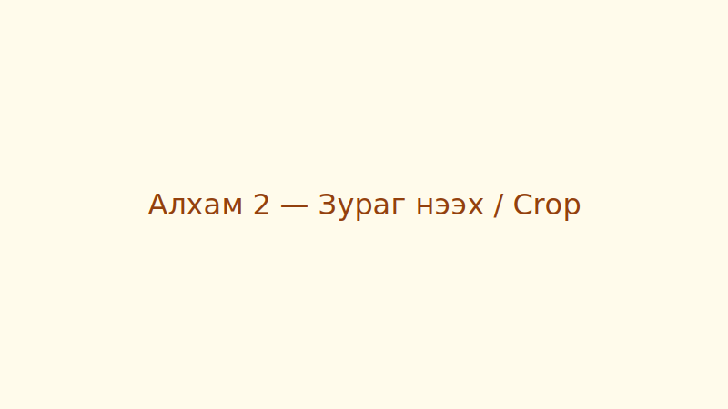

## Purpose
This page contains a concise, repeatable procedure to crop an image in Adobe Photoshop.

## Steps
1. Open Adobe Photoshop.
2. Choose **File → Open** and select the image you want to edit.
3. From the toolbar, select the **Crop Tool (C)**.
4. Click and drag on the canvas to define the crop bounds. Use the handles to adjust.
5. If needed, set an aspect ratio in the options bar (e.g. 16:9, 4:3, or `Unconstrained`).
6. Press **Enter** (Return) to apply the crop.
7. Save your work: **File → Save As** and choose `JPEG/PNG/PSD` as appropriate.

## Quick checks
- Ensure the crop doesn't remove important content near the edges.
- Use `Cmd+Z` (macOS) / `Ctrl+Z` (Windows) to undo mistakes.

## Notes
- For non-destructive editing, duplicate the original layer before cropping.
- Use `Image → Image Size` after cropping to adjust final output resolution for web or print.

