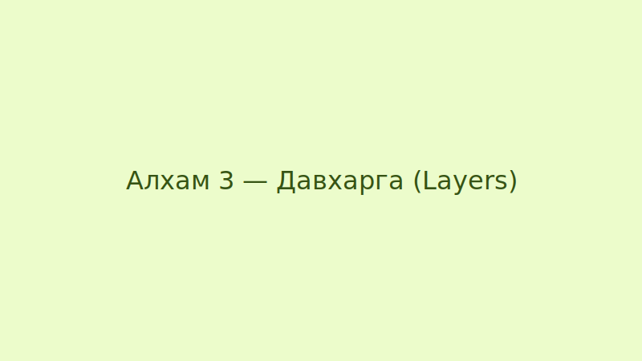

---
---

title: "Adobe Photoshop лавлах: Суурь хэрэгслүүд"
description: "Тодорхой хэрэгсэл, товчлол болон файлын форматын хурдан лавлах"

---

## Crop Tool
| Шийдэл | Тайлбар |
| --- | --- |
| Товчлуур | `C` |
| Зорилго | Зургийн илүүдэл хэсгийг тайрах, хэмжээг өөрчлөх |
| Байршил | Toolbar (Зүүн талын багажнаас) |

## Brightness / Contrast (Гэрэлтэл ба Контраст)
| Шийдэл | Тайлбар |
| --- | --- |
| Меню | `Image → Adjustments → Brightness/Contrast` |
| Brightness | Зургийн ерөнхий гэрэлтэл (хөнгөн/хар) тохируулна |
| Contrast | Гэрэл ба сүүдэр дунд ялгааг нэмэгдүүлнэ |

## Файлын форматууд
| Формат | Ашиглалт |
| --- | --- |
| JPG | Web-д хэрэглэгдэх фото зураг (зарим мэдээлэл алдагддаг) |
| PNG | Ил тод байдал шаардлагатай зурагт ашиглана |
| PSD | Photoshop эх файл — давхаргууд хадгалагдана |

## Товчлолууд (Shortcuts)
- Буцаах (Undo): `Cmd+Z` / `Ctrl+Z`
- Давхаргыг 복제лэх (Duplicate layer): `Cmd+J` / `Ctrl+J`
- Шинэ давхарга үүсгэх: `Shift+Cmd+N` / `Shift+Ctrl+N`

