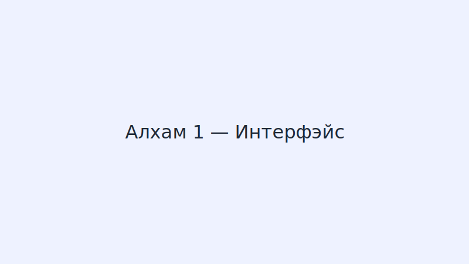
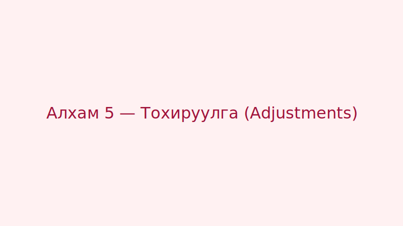
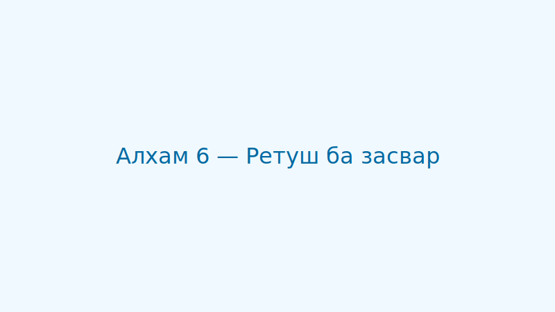
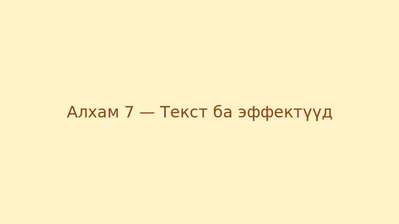
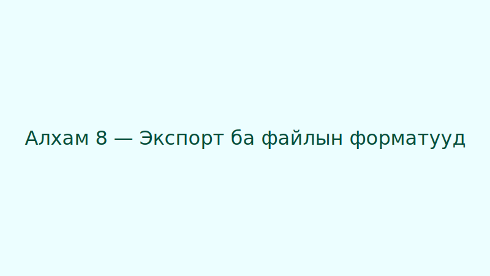

**Товч танилцуулга**

Энэхүү хичээл нь Adobe Photoshop-ын үндсэн хэрэглээг эхнээс нь зааж, хурдан үр дүнд хүрэхэд шаардлагатай алхмуудыг агуулна. Анхаар: жишээ зурагнууд `images/photoshop/` фолдeрт байрлана гэж тооцно.

**Шаардлага**
- Adobe Photoshop (сүүлийн хувилбар санал болгоно)
- Дунд зэргийн компьютер урсгалтай (RAM + GPU тохирно)
- Жишээ зураг (өөрийнхээ зураг эсвэл `images/photoshop/` руу зургууд байрлуулна)

**Хуваарь**
1. Интерфэйс танилцах
2. Зураг нээх, өөрчлөх
3. Давхарга (Layers) ашиглах
4. Сонголт, маск, зам (Selections & Masks)
5. Тохируулга (Adjustments)
6. Ретуш ба засвар (Healing, Clone)
7. Текст ба эффектүүд
8. Экспорт ба файлын форматууд

---

## 1. Интерфэйс танилцах

- Photoshop-ыг нээгээд `Window -> Workspace` дээрээс `Photography` эсвэл `Essentials` тохиргоог сонгоно.
- Баруу талд `Tools` панел байна: Move, Marquee, Lasso, Crop, Brush, Clone, Eraser, Gradient, Text г.м.
- Баруун талд `Layers`, `Properties`, `Adjustments` хавтаснууд байна.



## 2. Зураг нээх, өөрчлөх

1. `File -> Open` эсвэл зургийг баруун тал руу чирж буулгана.
2. `Image -> Image Size`-аар хэмжээг тохируулна (web: 72-150 dpi, print: 300 dpi).
3. `Image -> Crop`-аар шаардлагатай хувь болгон тайрна.


## 3. Давхарга (Layers)

- Шинэ давхарга үүсгэх: `Layer -> New -> Layer` эсвэл `Shift+Cmd+N`.
- Давхаргын тохиргоо: `Opacity`, `Blend Mode`-г ашиглана.
- Давхаргыг зэрэгцүүлж зохион байгуулна.


## 4. Сонголт ба маск (Selections & Masks)

- `Marquee` болон `Lasso` хэрэгслүүдээр сонгоно.
- `Select -> Select and Mask...`-аар нарийвчилсан маск үүсгэнэ.
- Маск ашиглах: давхаргад `Add Layer Mask` дээр дарж бусад хэсгийг нууж чадна.


## 5. Тохируулга (Adjustments)

- `Image -> Adjustments` эсвэл `Adjustments` панелаар `Levels`, `Curves`, `Hue/Saturation`, `Vibrance` зэрэг тохиргоог ашиглана.
- Non-destructive: `Layer -> New Adjustment Layer` ашиглана.



## 6. Ретуш ба засвар

- `Spot Healing Brush` болон `Healing Brush`-аар жижиг толбо засна.
- Том засварад `Clone Stamp` ашиглана.



## 7. Текст ба эффектүүд

- `T` товчоор текст оруулна. `Character` панелаар форматлана.
- Давхарганд `Layer Styles` ашиглан эффект (Drop Shadow, Stroke) нэмнэ.



## 8. Экспорт ба файлын форматууд

- Web: `File -> Export -> Export As...` (PNG/JPEG/WebP).
- Print: `File -> Save As...` (TIFF эсвэл PSD).



---

Жич: Жишээ зургуудыг `images/photoshop/` фолдeрт байрлуулна. MDX-д зургуудыг оруулах жишээ:

```md

```

Хүсвэл би алхам тус бүрт дэлгэрэнгүй үр дүнтэй заавар, хэвлэмэл PDF, эсвэл скринкаст нэмээд өргөжүүлж өгнө.
